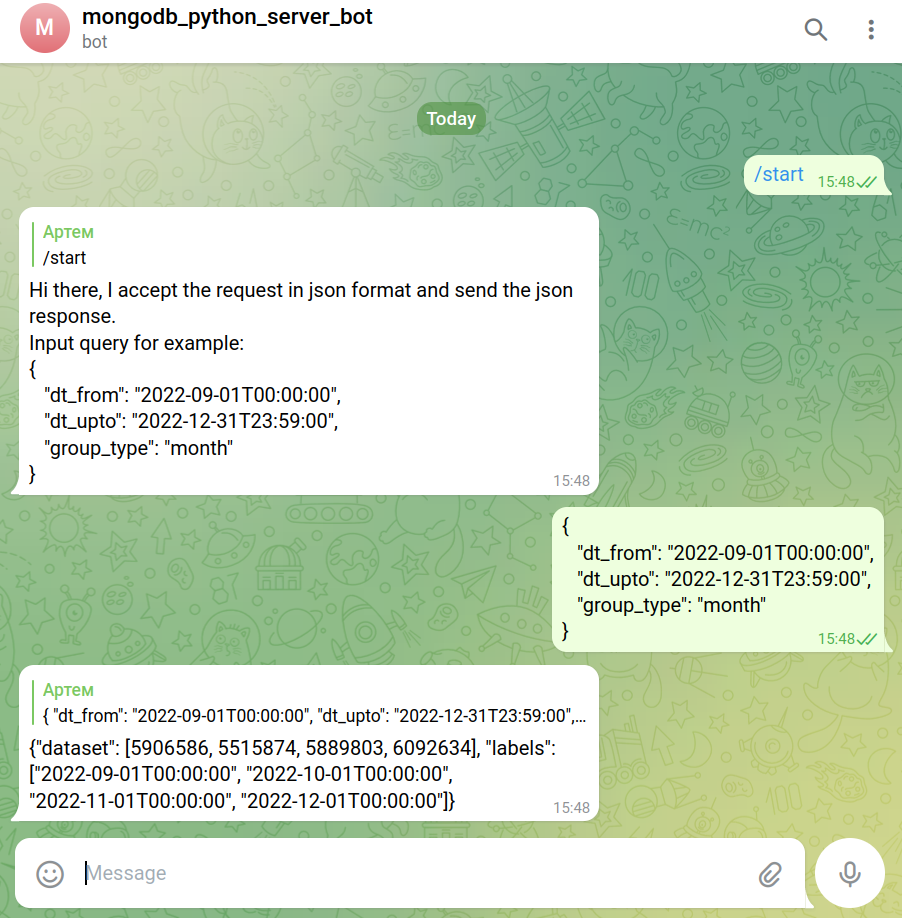

# ТЗ. Напишите алгоритм агрегирования статистических данных о заработной плате сотрудников компании по временным интервалам

Документ с техническим заданием: https://docs.google.com/document/d/1QyZdlsGBZwgCk8PuhOqRqULaF7CDpkpO/edit?usp=sharing&ouid=107707045957019905069&rtpof=true&sd=true

## Суть скрипта в оболочке бота
1) Получить валидный запрос в формате json.
   * Дату и время старта агрегации в ISO формате.
   * Дату и время окончания агрегации в ISO формате.
   * Тип агрегации (hour, day, month).
2) Если запрос не валидный, то отправить соответсвующее сообщение с ошибкой.
3) Если запрос валидный, то обработать и вернуть ответ в соответствии с ТЗ.
    * Получить переданный параметры.
    * Обратится к не реляционной БД(NoSQL) MongoDB через python-драйвер с формированным запросом.
    * Отсутствующие данные в промежутке заполнить стандартной датой и значением 0.
    * Отправить ответ в формате JSON пользователю.
    * Закрыть соединение c БД.

